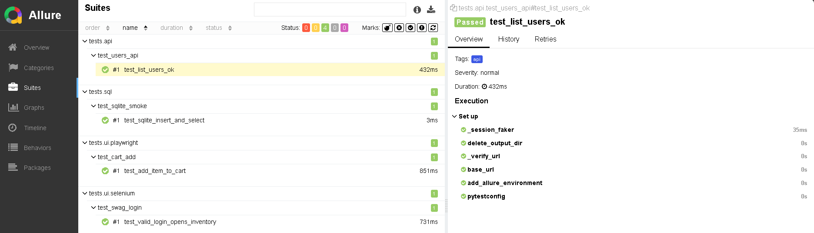
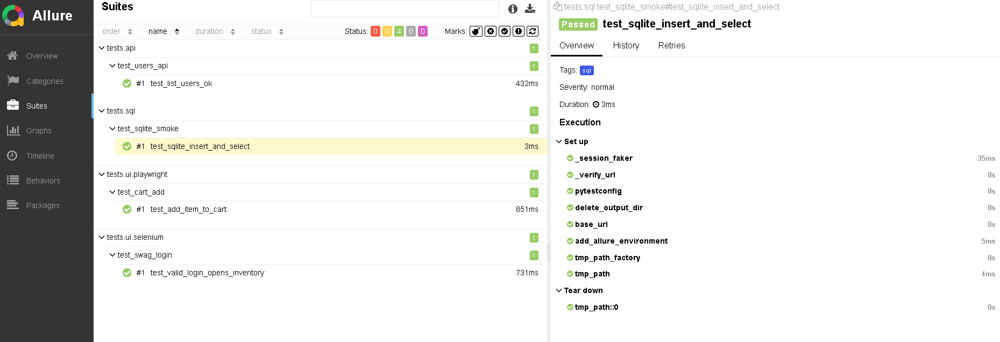
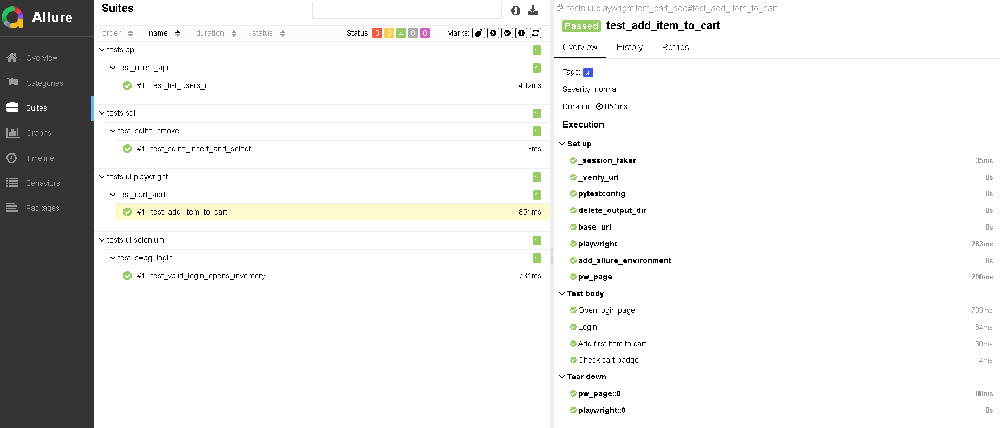
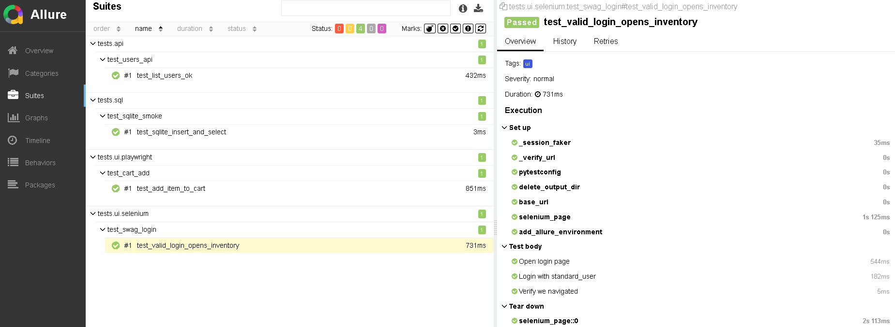
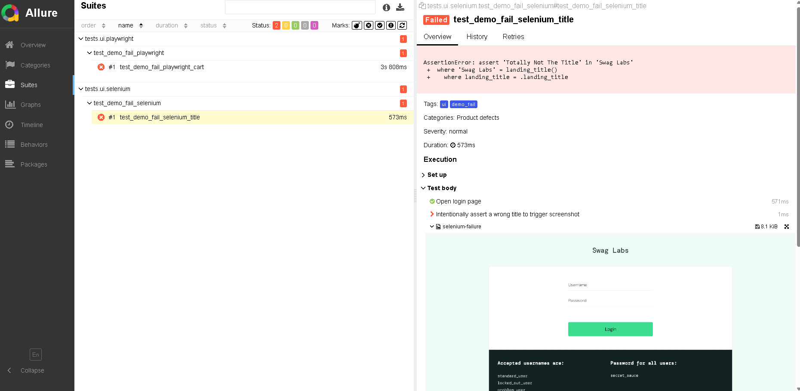
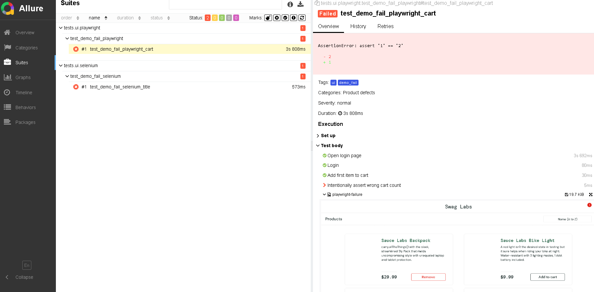

# 🧪 QA Portfolio (Python) — Selenium + Playwright + API + SQL

[](https://github.com/ozturkeren/QA-TPs_qa-portfolio-python/actions/workflows/ci.yml)
[](LICENSE)


This project is part of my **QA Test Engineering portfolio**.  
It demonstrates skills in **UI automation (Selenium & Playwright)**, **API testing (Requests + Pytest)**, **SQL checks (SQLite)**, **reporting with Allure**, and **CI integration via GitHub Actions**.  

---

## 📌 Project Overview
- Application under test: [SauceDemo](https://www.saucedemo.com/)  
- Scope:
  - UI automation with **Selenium WebDriver**  
  - UI automation with **Playwright**  
  - **API smoke tests** against a public REST API 
  - **SQL sanity** using SQLite (create/insert/select)  
  - **Allure reporting** with steps and **auto screenshots on failure**  
  - **GitHub Actions** pipeline (Ubuntu + Windows matrix, headless browsers)  

---

## 🛠 Tech Stack
- **Language**: Python 3.12  
- **Test Runner**: Pytest  
- **UI**: Selenium 4, Playwright  
- **HTTP/API**: Requests  
- **Reporting**: Allure (via `allure-pytest`)  
- **CI/CD**: GitHub Actions (Ubuntu + Windows matrix)  
- **Utilities**: Faker, python-dotenv, pytest-xdist  
- **IDE**: VS Code (works with IntelliJ IDEA Community as editor)

---

## ▶️ Running Tests Locally

### Prerequisites
- **Python 3.12** installed  
- **Google Chrome** (latest stable)  
- **Allure CLI** installed (e.g., `scoop install allure` on Windows)  
- **Playwright browsers** installed (e.g., `python -m playwright install`) 

### Quick start

```bash
# 1) Create & activate venv (Windows PowerShell)
python -m venv .venv
. .\.venv\Scripts\Activate.ps1

# 2) Install deps
pip install -r requirements.txt
python -m playwright install

# 3) Run the full suite (UI + API + SQL) and open Allure
pytest -m "ui or api or sql" --alluredir=allure-results
allure serve allure-results
```

#### Run just passing tests (exclude demo failures)

```bash
pytest -m "not demo_fail" --alluredir=allure-results-pass
allure generate allure-results-pass -o allure-report-pass --clean
allure open allure-report-pass
```

#### Run just demo failures tests (to see the screenshots)

```bash
pytest -m "demo_fail" --alluredir=allure-results-fail
allure generate allure-results-fail -o allure-report-fail --clean
allure open allure-report-fail
```

#### Targeted runs

```bash
# Only UI tests
pytest -m "ui" --alluredir=allure-results

# Only API tests
pytest tests/api/test_users_api.py --alluredir=allure-results

# Only SQL tests
pytest tests/sql/test_sqlite_smoke.py --alluredir=allure-results
```

---

## 📊 Viewing Reports

### 🔹 Allure (interactive)

```bash
# Live serve (auto-build + open)
allure serve allure-results

# Or generate a static site and open it
allure generate allure-results -o allure-report --clean
allure open allure-report
```

What you’ll see:
- Step-by-step execution with **Allure steps**  
- **Attachments** (auto screenshots on failure via Pytest hook)  
- Test history & categories (when available)

---


## 📷 Sample Screenshots — Passing Tests (manual captures)

Visual evidence from green runs

**API – List users (passed)**  


**SQL – SQLite smoke (passed)** 


**Playwright – Add to cart (passed)**  


**Selenium – Login flow (passed)**  


---

## 📷 Sample Screenshots (demo failures)

These tests intentionally **fail** to demonstrate failure analysis + screenshot capture.

**Selenium (intentional fail)**  


**Playwright (intentional fail)**  


---

## ⚙️ Continuous Integration

This project runs tests automatically on **every push/PR** via **GitHub Actions**.  
- Headless browsers on **ubuntu-latest** and **windows-latest**  
- Playwright browsers installed during workflow  
- **Allure results** uploaded as **artifacts** per OS  
- Status badge above reflects the latest build outcome  

Workflow file: `.github/workflows/ci.yml`

---

## 🧩 How imports “just work” in tests

The test suite prepends the **project root** and **`src/`** to `sys.path` inside `tests/conftest.py`, ensuring  
`from src.pages.swag_login_page import SwagLoginPage` resolves consistently (CLI, IDE, CI).  
I also provide Pytest fixtures (`selenium_page`, `pw_page`) and a failure hook to attach **screenshots** to Allure.

---

## 📄 License

This project is licensed under the [MIT License](LICENSE).  

---

## 🙋 About Me

I am an aspiring **QA/Test Engineer** focused on building clean and observable test suites that integrate seamlessly with developer workflows.  
I am open to **internship and junior QA opportunities** across the EU. 

📫 Connect with me on [LinkedIn](https://www.linkedin.com/in/ozturk-eren/) by sending messages.